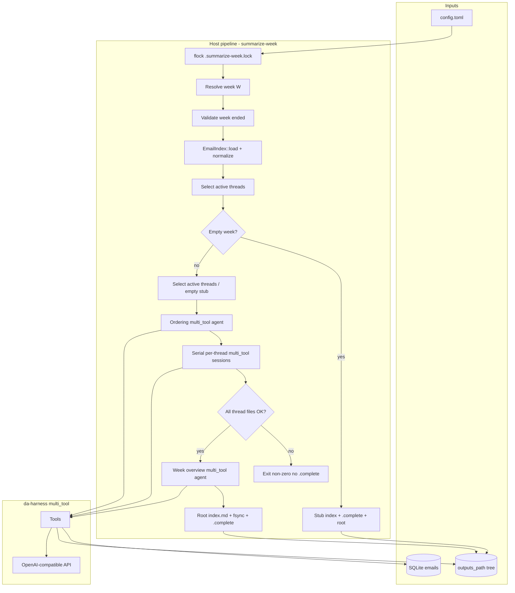

# Weekly Mailing List Discussion Summarizer

| Field | Value |
|---|---|
| **Author** | TBD |
| **Date** | 2026-08-10 |
| **Status** | Approved draft (rev 6 — lore links; no message markdown on disk) |
| **Workspace** | `/home/dan/vd/newnotes/workdirs/nfs-mailing-list-summary/new-code` |
| **Location** | `doc/design.md` |
| **Depends on** | `build-db` SQLite corpus; [da-harness](https://github.com/da-x/da-harness) `r/0.5` (`multi_tool`), pin git rev at implement time |

---

## Overview

This project already ingests a lore-style git mail archive into SQLite (`build-db`), indexes threads in memory (`EmailIndex`), and demos regex search (`grep`). Legacy sibling code (`../code/`) produced weekly journalistic summaries with one-shot LLM calls and Hugo publish — but dumped full thread bodies into prompts, had no multi-week memory, and did not expose discovery tools.

This design turns `new-code` into a **weekly discussion summarizer**: for each completed calendar week, the host selects active threads, then runs **da-harness multi_tool agents** in three stages: (1) an **ordering agent** that ranks the week’s discussions by dependency / reading order; (2) **one session per active thread**, executed **strictly serially** in that order; (3) a **week-overview** session. Agents explore mail (cleaned bodies from SQLite) and prior **summary** outputs via tools, then submit results through typed `submit_*` tools. **Per-message markdown is not written** under `outputs_path`; citations link out to [lore.kernel.org](https://lore.kernel.org/) (e.g. `https://lore.kernel.org/linux-nfs/<message-id-without-brackets>/`). Cleaned/trimmed bodies exist only as inference input. Previous week directories are never rewritten. Multi-week threads are handled by reading prior `thread/<id>.md` summaries; same-week threads summarized earlier in the serial order are also readable by later sessions.

Empty weeks still produce a completed stub edition so auto-advance never stalls. Thread failures continue (resume-friendly) but **never** mark a week complete or run overview until every expected thread file exists and overview succeeds.

---

## Background & Motivation

### Current state (`new-code`)

| Component | Path | Role |
|---|---|---|
| CLI | `src/main.rs` | Commands: `BuildDB`, `Meta`, `Grep` |
| Config | `src/config.rs` | `openai.{api_base,model_name,api_key}`, `git_repo_path`, `db_path`, `base_url`, `lore_base_url` (default `https://lore.kernel.org/linux-nfs/`), `outputs_path: Option<String>` |
| Git ingest | `src/git_handler.rs` | Walks commits with blob `m`, parses mail, runs `clean_email_body` before DB insert |
| Body cleaner | `src/content_cleaner.rs` | Strips patch diffs and large quote blocks at ingest |
| Models | `src/models.rs` | `EmailMessage`, `Thread` |
| Index | `src/email_index.rs` | `EmailMeta`, `MetaThread`, `EmailIndex::{load, threads, load_body, compose_thread_text, emails, get, load_all_bodies}` |
| Grep demo | `src/grep_cmd.rs` | Full-corpus body load + per-thread regex over composed text (summarize path must **not** call `load_all_bodies`) |
| Legacy LLM | `src/openai_client.rs` | One-shot `summarize_thread` / `summarize_week` via `async-openai` (to be replaced by da-harness) |

**DB schema** (created in `build_db`):

```sql
CREATE TABLE IF NOT EXISTS emails (
    message_id TEXT PRIMARY KEY NOT NULL,
    subject TEXT NOT NULL,
    from_addr TEXT NOT NULL,
    date TEXT NOT NULL,          -- RFC3339
    body BLOB NOT NULL,          -- zstd-compressed UTF-8 (already cleaned)
    in_reply_to TEXT,
    "references" TEXT NOT NULL   -- JSON array of Message-IDs
);
```

Observed corpus scale (local `.git/db.sqlite`): **143,492 emails**, date range **2002-01-09 → present**. A typical recent week has **~300 messages / ~45 threads** (e.g. 307 messages / 45 roots for 2026-03-09..15; matches sample outputs under `../infer/`).

**Message-ID storage note:** sampled rows store a **leading space** before `<…>` (mailparse `get_first_value` behavior) as the SQLite PRIMARY KEY. Summarize must keep that raw PK for body SQL while exposing only `normalize_message_id` (trim) to tools/agents/filenames (KD4 dual-ID: `message_id` + `message_id_raw`).

### Thread root rules (existing)

`email_index.rs` private `thread_root_id` (must become public and **normalize** each component):

1. If `references` non-empty → `normalize_message_id(references[0])`
2. Else if `in_reply_to` set → `normalize_message_id(in_reply_to)`
3. Else → `normalize_message_id(message_id)` (self-root)

`EmailIndex::threads()` groups by that root, sorts messages by date, sorts threads by last activity descending. **Same rule must drive week selection and filenames.**

### Pain points of the legacy approach (`../code/`, `../infer/`)

1. **Context flood**: entire active threads (including historical messages outside the week) fed into one prompt.
2. **No tool use**: model cannot search related subjects or prior week writeups.
3. **No multi-week continuity**: continuing threads re-summarized from scratch.
4. **Filename strategy**: subject-slug paths (`2026-03-09-patch-...md`) collide / drift; not stable across re-runs when subjects change mid-thread.
5. **Coupled publish**: inference mixed with Hugo site building.

### Why change now

Product goal is a **research agent** per discussion that can grep mail, open individual messages, glob prior outputs, and write a focused weekly delta — not a bulk dump summarizer. da-harness `multi_tool` on branch `r/0.5` provides typed tools (`Tool::new`), parallel tool calls, stop-style completion, retries, usage callbacks, and offline `inference_callback` testing.

---

## Goals & Non-Goals

### Goals

1. Add a CLI command that produces **exactly one completed week** of markdown under `config.outputs_path` (including empty weeks as stub editions).
2. Use **da-harness multi_tool** agents with a documented tool catalog (mail + outputs + submit).
3. Host does **not** archive message bodies under `outputs_path`. Agents produce **order**, **thread summaries**, and **week overview**. Cleaned bodies are loaded from SQLite only for inference tools (`GetEmail`, greps).
4. Message citations in published markdown use **lore permalinks** (`config.lore_base_url` + Message-ID without `<>`), not local files.
5. **Never rewrite** prior week outputs once `.complete` exists; agents may only read them.
6. Support **multi-week threads** via host-injected prior paths + glob/read of `{outputs_path}/*/thread/<thread-id>.md`.
7. Support **same-week dependencies** via an ordering agent + serial thread sessions that can read earlier same-week `thread/*.md` files.
8. Resume incomplete weeks; fail if the target week has not ended yet (UTC).
9. Keep `build-db` / `meta` / `grep` working; reuse `EmailIndex` and cleaned bodies.
10. Single-flight: exclusive lock so concurrent `summarize-week` process runs do not race.

### Non-Goals

1. Hugo / site publish pipeline (legacy `site_builder.rs` stays out of scope; outputs are plain markdown for later tooling).
2. Re-cleaning email bodies at summarize time (already cleaned at ingest in `git_handler.rs`).
3. Re-threading algorithms beyond existing `thread_root_id` rules (plus normalize).
4. Real-time / partial-week digests.
5. Editing or deleting prior week directories from the agent.
6. Multi-week batching in one process run (exactly one week per successful run).
7. Replacing SQLite with another store.
8. `--force` re-generate of a completed week (v1: no-op exit 0 if `.complete` present).
9. Auto-import of legacy `../infer/` subject-slug layout.

---

## Key Decisions

| # | Decision | Rationale |
|---|---|---|
| KD1 | **Week window** (half-open UTC): `[W−6 00:00:00 UTC, W+1 00:00:00 UTC)`. Folder name `W` is any calendar end date (not forced to Sunday / ISO week). | Avoids inclusive end-of-day float/chrono awkwardness; clear unit tests at day boundaries; matches product “arbitrary end-date.” |
| KD2 | **Agent granularity (ordered serial)**: (1) one **ordering** multi_tool session ranks all active threads by dependency / reading order; (2) one multi_tool session **per active thread**, run **strictly serially** in that order (never concurrent); (3) one **week overview** agent only if all expected thread files exist. Empty week: no agents (stub overview). | Dependencies between discussions (related subjects, patch series, “read A before B”) require a deliberate order; serial sessions let later agents read same-week summaries already written. Parallel thread agents are **out of scope**. |
| KD3 | **Completion protocol**: host does not write message archives; ordering agent submits `SubmitThreadOrder` (or host reuses valid `.thread-order.json`); thread/week agents finish via `submit_*` tools; **continue on thread failure** (still serial); never write root `index.md` or `W/.complete` until **all** expected `thread/*.md` exist **and** week overview succeeds; exit non-zero on any failure. Re-run reuses order file when valid, executes only missing thread files + overview. **Do not run overview** if any expected thread file is missing. Ordering failure aborts before new thread sessions. | Single consistent resume model; no hollow weeks; no premature “published” state. |
| KD4 | **ID policy**: `normalize_message_id` = trim whitespace (keep angle brackets as-is after trim). Every in-memory `EmailMeta` **must** retain both `message_id` (canonical normalized, all external use) and `message_id_raw` (exact SQLite PRIMARY KEY for body SQL). **Single keying contract for all of `EmailIndex`:** (1) external/agent/file ids = always normalized; (2) body `HashMap` keys from `load_all_bodies` = always **normalized** (so `compose_thread_text`’s `bodies.get(&msg.message_id)` works); (3) SQL `WHERE message_id = ?` = always `message_id_raw`. Lookups/tools/roots/front matter use normalized only. `file_stem_for_id` percent-encodes the normalized id, or `sha256` lowercase hex if encoded length > 200 (`sha2`). Collision: one map entry per normalized id; earliest-by-date wins; keep winner’s `message_id_raw`. **`build-db` does not rewrite historical PKs.** CLI `grep` needs no call-site changes beyond these internals. | Fixes leading-space corpus footgun without breaking SQL or grepping empty bodies. |
| KD5 | **No message files on disk**: in-window messages are selected for agents only. Cleaned bodies load from DB into tool results / prompts. Published thread files list messages as **lore links**, not local paths. | Avoids duplicating the public archive; lore is canonical. |
| KD6 | **Prior summaries**: host pre-globs and injects last **N=3** **cross-week** prior `*/thread/<stem>.md` paths into the thread user message. Additionally, for serial same-week work, host injects paths to **already-written same-week** `W/thread/<stem>.md` files that the ordering agent marked as prerequisites (or all same-week threads earlier in the order — see Step 6b). `GlobOutputs` / `ReadOutputFile` still available. Never rewrite prior week files. Continuity applies only to **new-layout** history (not `../infer`). | Multi-week + same-week dependency continuity without flooding the prompt. |
| KD7 | **LLM client**: da-harness `OpenAIClient::with_config(LLMConfig { … })` from `config.openai`. Pin **git rev** (not floating branch only). Delete unused `openai_client.rs` in PR7. | Reproducible builds; typed tools + agent loop. |
| KD8 | **Active thread set**: any thread with ≥1 message in the week window (root via normalized `thread_root_id`). Same thread-root rules as today; activity is calendar-window based (stricter/clearer than legacy rolling 7-day cutoff in `process_threads`). | Product week semantics. |
| KD9 | **Week completeness gate**: if `Utc::now().date_naive() <= W`, fail. **UTC only** (no local-time folder naming). | Prevents incomplete-week summaries; timezone closed. |
| KD10 | **Progress markers**: `W/.complete` (empty file) for published completion, written **last** after fsync of `W/index.md` and root `index.md`. Resume aids: `W/.thread-order.json` (ordering agent result) while incomplete; per-thread skip if `thread/<stem>.md` already exists. No dual `state.json`. | Simplest resume; order file avoids re-ranking on every partial re-run; failed thread list lives in process logs (`failed_thread_ids`). |
| KD11 | **Empty week**: if zero messages in window → create `W/`, write stub `W/index.md` (“No mailing list activity in this week.”), write `.complete`, update root index, exit 0. No agents. Auto-advance continues next run. | Empty holiday/corpus-lag weeks must not stall `W_last+7` progression. |
| KD12 | **Failure / overview gate**: continue after thread failures; collect `failed_thread_ids`; **never** run week overview unless `failed == 0` and every expected stem has a file; never `.complete` / root update otherwise; exit non-zero. | Prevents hollow overview and premature complete (Issue 25). |
| KD13 | **Concurrent runs**: exclusive `flock` on `{outputs_path}/.summarize-week.lock`; second process exits non-zero immediately. | Cron re-entry safety. |
| KD14 | **Session timeouts**: `tokio::time::timeout` **10 min** for the ordering agent, **15 min** per thread agent, **20 min** for week agent; on timeout → treat as failure (drop incoming `tx`, cancel/await run). Ordering failure fails the run before any new thread sessions (unless a valid order file already exists for resume). | Prevents hung cron on missing submit. |
| KD15 | **CLI week resolution**: “Complete week” = dir containing `.complete`. **Incomplete dirs do not count as +7 anchors.** Priority: (1) `--week` wins; (2) if any incomplete week dir exists → **resume it** (exactly one incomplete allowed; if multiple incomplete → error; ignore `--start-week` with warning); (3) if ≥1 complete and no incomplete → auto `W_last_complete + 7`; (4) if no complete and no incomplete → require `--start-week`. If complete weeks exist, `--start-week` that disagrees with auto chain → error. No `--force` in v1 (complete + `--week` → exit 0 no-op). See matrix. | Prevents abandoned incomplete dirs and ambiguous bootstrap. |
| KD16 | **Overview re-run**: if `.complete` absent and all expected thread files present → **always** re-run week overview and may rewrite `W/index.md`; write root index then `.complete` last (fsync). | Partial overview failure is recoverable. |
| KD17 | **Week agent tools**: `GlobOutputs`, `GrepOutputs`, `ReadOutputFile`, `SubmitWeekOverview` only (no mail tools). Host provides the full thread list + paths in the user message. | Overview should not re-research mail; cheaper and focused. |
| KD18 | **Root index one-liner**: use `SubmitWeekOverview.headline` (required field). Empty-week stub uses a fixed headline (“No activity”). | No brittle heading parse. |
| KD19 | **Citations**: messages → absolute lore URLs via `lore_url_for_message_id(lore_base_url, id)` (strip `<>` from normalized Message-ID). Same-week / cross-week **summaries** → relative `thread/<stem>.md` links. Host may post-process leftover `id://` into lore. | Public archive is lore; summaries stay local. |
| KD25 | **`lore_base_url`**: config default `https://lore.kernel.org/linux-nfs/`. Example: Message-ID `<20260720-tcp-read-sock-v2-6-29545d034f3c@kernel.org>` → `https://lore.kernel.org/linux-nfs/20260720-tcp-read-sock-v2-6-29545d034f3c@kernel.org/`. | Matches public lore path convention. |
| KD20 | **GrepEmails defaults**: when `focus_thread_root` is set and agent omits dates, default date window to current week; hard cap bodies scanned (200) and matches (50). Cross-thread override allowed but more aggressively capped (e.g. 20 matches). | 143k corpus must not thrash. |
| KD21 | **Submit payload channel**: `Mutex<Option<Payload>>` or `mpsc`; double-submit returns tool error `"already submitted"`. | Aligns with harness stop pattern; no oneshot double-fire panic. |
| KD22 | **Path sandbox**: reject absolute paths and `..` components; canonicalize `outputs_path` once at start; existing files: canonicalize + prefix check; missing → clear tool error (do not require canonicalize of missing paths). | Unix `canonicalize` existence footgun. |
| KD23 | **Thread-agent focus**: tools default to `focus_thread_root` unless the agent explicitly passes another `thread_root_id`; week agent leaves focus unset. | Cost control. |
| KD24 | **Serial only**: thread agents **never** run in parallel. No `--concurrency` flag. Within a single agent session, `parallel_tools(true)` may still run **read-only tool calls** concurrently; that is tool-level parallelism, not multi-thread-agent concurrency. | Product requires dependency-aware ordering and same-week summary handoff; parallel agents would race that model. |

---

## Proposed Design

### Architecture



### Output filesystem layout

For week ending **2026-07-20** (`W = 2026-07-20`):

```
{outputs_path}/
  .summarize-week.lock              # exclusive flock target (not a week dir)
  index.md                          # root catalog; rewritten only when a week completes
  2026-07-20/
    .complete                       # empty marker; written LAST after fsync
    .thread-order.json              # ordered root_ids from ordering agent (resume)
    index.md                        # week overview + thread list with links
    thread/
      <file_stem_for_id(root)>.md   # per-thread summary for this week
                                  # (message citations → lore URLs, not local files)
```

There is **no** `messages/` directory. Cleaned bodies remain in SQLite for `GetEmail` / greps only.

**Prior-week discovery:**

```text
host: pre-glob "*/thread/<stem>.md", take last 3 by week date, inject into user prompt
agent: may still GlobOutputs "*/thread/<stem>.md" for deeper history
```

Legacy `../infer/**/threads/*.md` uses a different layout and **will not** match; multi-week continuity starts after the first successful new-layout week.

### Message-ID normalize, raw PK, and file stems (KD4)

**Contract:** SQLite `emails.message_id` remains the **raw PRIMARY KEY** as written by `build-db` (often with a leading space). Summarize **never** rewrites historical PKs. Normalization is a **read-path** concern only.

#### In-memory meta (mandatory dual IDs)

```rust
pub struct EmailMeta {
    /// Canonical form for all external use: tools, agents, front matter, roots, stems.
    pub message_id: String,
    /// Exact SQLite PRIMARY KEY string; **only** used for body SQL and debug logs.
    pub message_id_raw: String,
    pub subject: String,
    pub from: String,
    pub date: DateTime<Utc>,
    pub in_reply_to: Option<String>, // store normalized parent id (or normalize on read)
    pub references: Vec<String>,     // elements may be raw from DB; always normalize before use
}
```

Load-time rules for `EmailIndex::load`:

1. For each row, set `message_id_raw = row.message_id` (verbatim PK), `message_id = normalize_message_id(&row.message_id)`.
2. Index map: `by_message_id: HashMap<String /*normalized*/, usize>` (not raw).
3. **Collision:** if a second row normalizes to an id already in the map, keep the **earliest-by-date** entry; log warning with both `message_id_raw` values; discard the later row from the index (its blob is not reachable via tools).
4. Build `replies_to` by looking up `normalize_message_id(in_reply_to)` in the normalized map (parent may be missing → no edge).
5. `get` / `contains` / `get_normalized`: `normalize_message_id(input)` then map lookup.
6. `thread_root_id`: normalize `references[0]` / `in_reply_to` / self (`message_id` already normalized).

#### Body load path (mandatory raw PK)

Existing API shape can stay, but the **summarize path** must resolve raw PK before SQL:

```rust
/// Accept flexible id (raw or trimmed). Normalize → index lookup → SQL with raw PK.
pub async fn load_body(pool: &SqlitePool, index: &EmailIndex, id: &str) -> Result<String> {
    let meta = index
        .get(id) // normalizes input internally
        .ok_or_else(|| anyhow!("unknown message_id after normalize: {id}"))?;
    // CRITICAL: bind message_id_raw, not message_id (normalized).
    let row = sqlx::query!(
        r#"SELECT body AS "body!" FROM emails WHERE message_id = ?"#,
        meta.message_id_raw
    )
    .fetch_one(pool)
    .await?;
    decompress_body(&row.body)
}
```

Do **not** call a raw-PK-only `load_body(pool, normalized_id)` with a trimmed id against this corpus — it will miss every row that has a leading-space PK. Always resolve via index → `message_id_raw`.

Tools (`GetEmail`, materialization, optional bulk loads):

```text
input id (any whitespace) → normalize → EmailMeta → SQL WHERE message_id = meta.message_id_raw
tool / front matter output → meta.message_id only (normalized); never expose message_id_raw to agents
```

#### Body map + `compose_thread_text` + CLI `grep` (same contract)

Today’s code (pre-dual-ID) keys `load_all_bodies` by the SQL column and looks up with `msg.message_id` — both raw. After dual-ID, those must stay **aligned on normalized keys**, or CLI `grep` silently gets empty bodies (Goal 7 regression).

| API | Key / bind form | Rule |
|---|---|---|
| External / agent / front matter / stems / roots | **normalized** `message_id` | Only form callers outside SQL see |
| `HashMap` from `load_all_bodies` | **normalized** keys | After `SELECT message_id, body`, insert under `normalize_message_id(&row.message_id)`; on collision same earliest-by-date fold as index load |
| `compose_thread_text` | `bodies.get(&msg.message_id)` | Works because `msg.message_id` is normalized and the map uses normalized keys |
| SQL `WHERE message_id = ?` | **`message_id_raw` only** | Single-row body fetch (`load_body`) and any other direct SQL |

```rust
/// Keys are always normalized message_ids (not SQLite PK).
pub async fn load_all_bodies(pool: &SqlitePool) -> Result<HashMap<String, String>> {
    let rows = sqlx::query!(r#"SELECT message_id, body AS "body!" FROM emails"#)
        .fetch_all(pool)
        .await?;
    let mut bodies = HashMap::with_capacity(rows.len());
    // Optional: date-ordered pass for collision fold consistency with EmailIndex::load
    for row in rows {
        let key = normalize_message_id(&row.message_id);
        let text = decompress_body(&row.body)?;
        // If key already present, keep earliest-by-date winner (needs date join or
        // prefer loading through EmailIndex order). Document: same collision policy as index.
        bodies.entry(key).or_insert(text);
    }
    Ok(bodies)
}

/// Unchanged call shape; relies on normalized map keys matching msg.message_id.
pub fn compose_thread_text(
    &self,
    thread: &MetaThread,
    bodies: &HashMap<String, String>,
) -> String {
    // ...
    // bodies.get(&msg.message_id)  // msg.message_id is normalized
}
```

**CLI `grep` (`src/grep_cmd.rs`):** keep the existing call pattern —

```rust
let index = EmailIndex::load(pool).await?;
let bodies = EmailIndex::load_all_bodies(pool).await?;
// index.compose_thread_text(thread, &bodies)
```

No call-site changes required once `load` / `load_all_bodies` / `compose_thread_text` honor the table above. Summarize path still prefers on-demand `load_body` (not full-corpus `load_all_bodies`).

#### File stems

```rust
use sha2::{Digest, Sha256};

/// Canonical Message-ID form for lookups, tools, front matter, roots.
/// Trim Unicode whitespace only; keep angle brackets as-is after trim.
pub fn normalize_message_id(id: &str) -> String {
    id.trim().to_string()
}

/// Percent-encode normalized id (RFC 3986 unreserved left alone).
fn percent_encode_id(normalized: &str) -> String {
    let mut out = String::with_capacity(normalized.len() * 3);
    for b in normalized.bytes() {
        match b {
            b'A'..=b'Z' | b'a'..=b'z' | b'0'..=b'9' | b'-' | b'_' | b'.' | b'~' => {
                out.push(b as char);
            }
            _ => out.push_str(&format!("%{b:02X}")),
        }
    }
    out
}

/// Lowercase hex SHA-256 of bytes (64 chars, no `0x` prefix). Dependency: `sha2` crate.
fn sha256_hex_lower(bytes: &[u8]) -> String {
    let digest = Sha256::digest(bytes);
    digest.iter().map(|b| format!("{b:02x}")).collect()
}

/// Filename stem (no `.md`) for messages and threads.
/// Always runs on normalized id. If percent-encoded length > 200,
/// stem is 64-char lowercase sha256 hex; file is still `{stem}.md`.
pub fn file_stem_for_id(id: &str) -> String {
    let n = normalize_message_id(id);
    let enc = percent_encode_id(&n);
    if enc.len() > 200 {
        sha256_hex_lower(n.as_bytes())
    } else {
        enc
    }
}
```

Add to `Cargo.toml` in PR1: `sha2 = "0.10"` (or current compatible).

**Worked example (DB → normalize → SQL → stem):**

| Stage | Value |
|---|---|
| Raw SQLite PK (`message_id_raw`) | `" <abc@def.com>"` (leading space) |
| Canonical (`message_id`) | `"<abc@def.com>"` |
| Body SQL bind | `" <abc@def.com>"` (= `message_id_raw`) |
| Front matter / tool result `message_id` | `"<abc@def.com>"` |
| `file_stem_for_id` | `%3Cabc%40def.com%3E` |
| Lore URL | `https://lore.kernel.org/linux-nfs/abc@def.com/` |
| On-disk (thread only) | `thread/%3Cabc%40def.com%3E.md` when root is this id |

Uniqueness is on the **normalized** form. Hash-stem case: front matter still holds full normalized id (not the raw PK); agents never need `message_id_raw`.

### Week resolution matrix (KD15)

Definitions:

- **Complete week dir:** `YYYY-MM-DD/` containing `.complete`.
- **Incomplete week dir:** `YYYY-MM-DD/` **without** `.complete`.
- Incomplete dirs are **not** progression anchors for `+7` (only complete weeks define the chain head).
- At most **one** incomplete week dir is allowed in normal operation; **multiple incomplete → error** (operator must finish or delete extras).

| Inputs | Condition | Result |
|---|---|---|
| `--week W` | `W/.complete` exists | **Exit 0 no-op** (log “week already complete”). No agent work. No `--force` in v1. |
| `--week W` | `W/` missing or incomplete (no `.complete`) | Process **W** (create if needed); resume skips existing `thread/*.md`. Still subject to `assert_week_ended(W)`. |
| `--week W` | `W` not yet ended (UTC) | **Error** non-zero. |
| any (no `--week`) | **>1 incomplete** week dirs | **Error**: list them; operator must clean up. |
| any (no `--week`) | **exactly 1 incomplete** week dir `I` | **Resume `I`**. If `--start-week` also set, **ignore it with warning**. |
| no `--week`, no incomplete | ≥1 complete; `W_last` = max complete date | `W = W_last + 7 days` (may be empty → stub complete). |
| no `--week`, no incomplete, no complete | outputs empty of week dirs | Require `--start-week S`; process `S`. |
| `--start-week S` only | no complete **and** no incomplete | Bootstrap: process `S`. |
| `--start-week S` only | no complete **but** one incomplete `I` | **Resume `I`**, ignore `S` with warning (same as incomplete-first rule). |
| `--start-week S` | ≥1 complete exists and auto target ≠ `S` (and no incomplete, or after incomplete resolved) | **Error**: `--start-week` is bootstrap-only; do not jump the chain. |
| `--week` and `--start-week` both set | — | **`--week` wins**; `--start-week` ignored with warning. |

```text
function week_window(W: NaiveDate) -> (DateTime<Utc>, DateTime<Utc>):
  start = DateTime::<Utc>::from_naive_utc_and_offset(
            W.checked_sub_days(Days::new(6)).unwrap().and_hms_opt(0,0,0).unwrap(), Utc)
  end_exclusive = DateTime::<Utc>::from_naive_utc_and_offset(
            W.checked_add_days(Days::new(1)).unwrap().and_hms_opt(0,0,0).unwrap(), Utc)
  // half-open: start <= t < end_exclusive
  return (start, end_exclusive)

function assert_week_ended(W):
  if Utc::now().date_naive() <= W:
    bail("week ending {W} has not ended yet (UTC)")
```

**CLI sketch:**

```rust
SummarizeWeek {
    /// Bootstrap only when no complete weeks exist.
    #[arg(long)]
    start_week: Option<String>, // YYYY-MM-DD
    /// Explicit week end date; wins over auto-resolve (see matrix).
    #[arg(long)]
    week: Option<String>,
}
```

Config: `outputs_path` must be `Some`.

### Concurrent run lock (KD13)

At start of `summarize-week`, after validating config:

1. Ensure `outputs_path` exists (create if missing).
2. `canonicalize(outputs_path)` once → `outputs_root`.
3. Open/create `outputs_root/.summarize-week.lock` and take **exclusive non-blocking flock**.
4. If lock unavailable → log and **exit non-zero** (“another summarize-week is running”).
5. Hold lock for the entire run (including empty-week stub path); release on drop.

### Host pipeline (detailed)

```mermaid
sequenceDiagram
  participant CLI
  participant Host
  participant Lock as flock
  participant DB
  participant FS as outputs_path
  participant Agent as multi_tool agent
  participant LLM

  CLI->>Host: summarize-week
  Host->>Lock: exclusive lock or exit
  Host->>FS: resolve W (matrix)
  alt W already .complete and explicit --week
    Host-->>CLI: exit 0 no-op
  end
  Host->>Host: assert week ended
  Host->>DB: EmailIndex::load (normalized keys)
  Host->>Host: select threads in half-open window
  alt zero messages
    Host->>FS: mkdir W; stub index.md; root index; fsync; .complete
    Host-->>CLI: exit 0
  end
  Note over Host: cleaned bodies stay in DB for tools; no message files on disk
  alt no valid .thread-order.json
    Host->>Agent: ordering session 10m timeout
    Agent->>LLM: research deps / related subjects
    Agent->>Host: SubmitThreadOrder
    Host->>FS: write .thread-order.json
  end
  loop each root_id in order SERIALLY (skip if thread md exists)
    Host->>Agent: thread session 15m timeout
    Agent->>LLM: tool loop
    Agent->>Host: SubmitThreadSummary or fail/timeout
    Host->>FS: write thread/*.md on success
  end
  alt any missing thread file
    Host-->>CLI: exit non-zero (no overview, no .complete)
  end
  Host->>Agent: week overview 20m timeout
  Host->>FS: W/index.md; root index.md; fsync; .complete last
  Host-->>CLI: exit 0
```

#### Step 1–2: Resolve & validate week

Apply resolution matrix + `assert_week_ended`. Acquire lock first.

#### Step 3: Load index

```rust
let pool = open_db(&config.db_path, false).await?;
// Load builds dual IDs: message_id (normalized) + message_id_raw (SQLite PK).
let index = EmailIndex::load(&pool).await?;
```

#### Step 4: Select active threads / empty week

```rust
let (start, end_excl) = week_window(w);
let mut active: BTreeMap<String, Vec<usize>> = BTreeMap::new(); // stable order by root
for (idx, msg) in index.emails().iter().enumerate() {
    if msg.date >= start && msg.date < end_excl {
        let root = thread_root_id(msg); // uses normalized message_id / refs
        active.entry(root).or_default().push(idx);
    }
}
// Sort each thread's in-window indices by date
```

**If `active` is empty (KD11):**

1. `mkdir -p W/thread`.
2. Write `W/index.md`:

```markdown
---
week_ending: "2026-07-20"
headline: "No activity"
empty: true
---

# No mailing list activity in this week.

No messages in the database fell within the UTC window
`[2026-07-14 00:00:00, 2026-07-21 00:00:00)`.
```

3. Regenerate root `index.md` (include this week).
4. fsync relevant files; write `W/.complete`.
5. Exit 0.

#### Step 5: Message handling (no on-disk archive)

- **Do not** write per-message markdown under `outputs_path`.
- In-window messages are selected for agents; bodies loaded via `EmailIndex::load_body` (raw PK) **only when tools / prompts need them**.
- Host-built message lists in `thread/*.md` use lore links:

```markdown
## Messages this week

- [2026-07-18 Alice — subject](https://lore.kernel.org/linux-nfs/20260720-tcp-read-sock-v2-6-29545d034f3c@kernel.org/)
```

URL construction (`src/lore.rs`):

```rust
// normalize → strip <> → join lore_base_url
// e.g. " <id@x>" → "https://lore.kernel.org/linux-nfs/id@x/"
fn lore_url_for_message_id(lore_base: &str, message_id: &str) -> String;
```

Config: `lore_base_url` (default `https://lore.kernel.org/linux-nfs/`).

#### Step 6a: Ordering agent (KD2, KD14)

**Goal:** produce a total order over the expected thread set so dependent discussions run later and can read earlier same-week summaries.

Expected set = keys of `active` (normalized root ids).

**Resume:** if `{W}/.thread-order.json` exists, is valid JSON, and its `ordered_root_ids` is a **permutation of the current expected set** (same multiset of ids), **reuse it** and skip the ordering agent. If the expected set changed (DB grew mid-resume) or the file is corrupt → delete/ignore and re-run ordering.

**Ordering agent input (host-built user message):** catalog of every active thread for the week:

```text
Week ending: 2026-07-20
For each thread (unordered catalog):
  - root_id (normalized)
  - subject
  - message_count_this_week
  - first_date / last_date in window
  - sample from-addrs (optional, capped)
Order these discussions for serial summarization. Prefer: foundations /
parent series before follow-ups; “depends on” / “related to” subjects after
their prerequisites; independent topics in any stable preference (e.g. by
last activity descending is fine).
Call SubmitThreadOrder exactly once with every root_id exactly once.
```

**Ordering agent tools:** `GrepEmails`, `SearchRelatedThreads`, `ListThreadMessages`, `GrepOutputs`, `GlobOutputs`, `ReadOutputFile`, `SubmitThreadOrder`. No `SubmitThreadSummary` / `SubmitWeekOverview`. Focus unset. Timeout **10 minutes**.

**`SubmitThreadOrder` payload:**

```json
{
  "ordered_root_ids": ["<id1>", "<id2>", "..."],
  "notes": "optional short rationale for the host logs only"
}
```

**Host validation after submit:**

1. Normalize every id in `ordered_root_ids`.
2. Require **exactly the expected set**: no missing, no extras, no duplicates.
3. On validation failure → treat as ordering failure: **do not** write `.thread-order.json`, **do not** start thread agents, exit non-zero (or re-prompt once — v1: fail).
4. On success → write `{W}/.thread-order.json` (pretty JSON including `week_ending`, `ordered_root_ids`, optional `notes`). This file is **not** part of the published markdown catalog; it is resume state. It may be rewritten only while `.complete` is absent.

**Fallback if ordering is unavailable:** none in v1 — ordering is mandatory for non-empty weeks (product: dependency-aware order). Offline tests may inject a fixed order via `inference_callback` without a live model.

#### Step 6b: Serial per-thread agents (KD2, KD3, KD6, KD12, KD14)

Process **strictly one thread session at a time**, in `ordered_root_ids` order. **No** concurrent thread agents.

For each `root_id` in order:

1. If `{W}/thread/{file_stem_for_id(root_id)}.md` exists → **skip** (resume).
2. Host globs **cross-week** prior summaries; injects last **N=3** paths into the user message (KD6).
3. Host also injects **same-week predecessors already on disk**: every `W/thread/<stem>.md` for roots **earlier in the order** that already exist (from this run or a previous partial run). Prefer listing those the ordering notes marked as related when notes exist; otherwise list all earlier same-week files (cap e.g. 10 paths with a note that more exist via GlobOutputs).
4. Run multi_tool session with **15 minute** timeout (see Session lifecycle). Fresh session per thread (no shared conversation history across threads).
5. On successful submit → write thread file (host wraps agent body + host-built **lore-linked** message list). Later sessions may `ReadOutputFile` this path.
6. On failure/timeout → **do not** write thread file; push `root_id` to `failed_thread_ids`; **continue** to the next root in order (still serial).

After the loop:

- If any expected file missing or `failed_thread_ids` non-empty → log `failed_thread_ids`, **do not** run overview, **do not** write `.complete` or update root, **exit non-zero**.

**Thread markdown shape:**

```markdown
---
thread_root_id: "<normalized>"
week_ending: "2026-07-20"
subject: "..."
message_ids_this_week:
  - "<normalized>..."
prior_summaries:
  - "2026-07-13/thread/<stem>.md"
  - "2026-07-06/thread/<stem>.md"
---

# <Subject>

## Summary

<agent markdown — lore URLs for messages; relative links for thread summaries>

## Messages this week

- [2026-07-18 From Name — subject](https://lore.kernel.org/linux-nfs/<bare-message-id>/)
- ...
```

Message list is **host-generated** with lore URLs (KD19/KD25). Agent narrative cites messages via lore URLs and other threads via relative `thread/<stem>.md` links.

#### Step 7: Week overview agent (KD16, KD17)

**Gate:** all expected `thread/*.md` present and zero failures this run (or previous files already present covering the full expected set).

1. User prompt: week dates, full list of thread titles + relative paths, host-provided TOC candidates, instruction to `ReadOutputFile` as needed.
2. Tools: outputs read/glob/grep + `SubmitWeekOverview` only (no mail tools).
3. **Always re-run** overview when `.complete` is absent (even if `W/index.md` already exists from a partial previous attempt).
4. Timeout **20 minutes**.
5. On success, host writes `W/index.md` = agent body + host TOC; capture `headline` for root index.
6. On failure/timeout → no root update, no `.complete`, exit non-zero.

Tone reference: `../infer/2026-03-15/_index.md` (journalistic, NFS-focused). Citations: relative links to `thread/<stem>.md`.

#### Step 8: Root index + completion (`.complete` last)

Critical section when week fully succeeds (or empty stub):

1. Write/rewrite `W/index.md` (if not already written in step 7 / stub).
2. Regenerate root `index.md` from all week dirs that will be complete (existing `.complete` plus this `W`):

```markdown
# NFS Mailing List Weekly Summaries

- [Week ending 2026-07-20](2026-07-20/index.md) — <SubmitWeekOverview.headline or stub>
- [Week ending 2026-07-13](2026-07-13/index.md) — ...
```

3. fsync `W/index.md` and root `index.md` (and preferably the directory).
4. Write empty `W/.complete` **last**.
5. Exit 0.

If the process dies between root write and `.complete`, re-run is safe: no `.complete` ⇒ overview re-runs; root regeneration is idempotent.

### da-harness multi_tool integration

**Pin revision** (KD7). At design time, `r/0.5` tip was:

```
1f866f7224d51bc99d3ad5a04458cd3f46d10c3e  # multi_tool: add seed_messages …
```

```toml
# Implementers: re-resolve tip of r/0.5 at PR5 land time and pin rev=;
# upgrade by bumping rev deliberately after reading da-harness CHANGELOG/commits.
da-harness = { git = "https://github.com/da-x/da-harness", rev = "1f866f7224d51bc99d3ad5a04458cd3f46d10c3e" }
```

How to upgrade: `git ls-remote` / checkout `r/0.5`, run crate tests + offline agent tests, bump `rev` in Cargo.toml in a dedicated commit.

Client construction:

```rust
let client = da_harness::OpenAIClient::with_config(da_harness::LLMConfig {
    api_base: config.openai.api_base.clone(),
    model_name: config.openai.model_name.clone(),
    api_key: config.openai.api_key.clone(),
    max_context_tokens: None,
    extra_headers: Default::default(),
});
```

### Session lifecycle (timeout + submit) (KD14, KD21)

Align with `da-harness/tests/multi_tool.rs`: send user message → wait for stop/submit signal → drop incoming `tx` → await `run`. Add hard deadline.

```rust
use std::sync::{Arc, Mutex};
use da_harness::multi_tool::{AgentInvocationArgs, Tool, UserRequest};
use tokio::time::{timeout, Duration};

struct SubmitSlot<T>(Mutex<Option<T>>);

// In SubmitThreadSummary handler:
//   let mut g = slot.lock().unwrap();
//   if g.is_some() { return Ok("ERROR: already submitted".into()); }
//   *g = Some(payload);
//   Ok("submitted".into())

let slot = Arc::new(SubmitSlot(Mutex::new(None)));
let (tx, rx) = tokio::sync::mpsc::channel(8);

let invocation = AgentInvocationArgs::default()
    .system_prompt(THREAD_SYSTEM_PROMPT)
    .tools(build_thread_tools(/* ..., slot.clone() */)?)
    .parallel_tools(true)
    .incoming(rx)
    .retry_strategy(
        da_harness::multi_tool::tokio_retry::strategy::ExponentialBackoff::from_millis(200)
            .map(da_harness::multi_tool::tokio_retry::strategy::jitter)
            .take(4),
    )
    .usage_callback(Arc::new(|u| {
        tracing::info!(prompt = u.prompt_tokens, completion = u.completion_tokens, "llm usage");
    }))
    .build()?;

let run = tokio::spawn(invocation.run(client.clone()));
tx.send(UserRequest::Message(
    async_openai::types::ChatCompletionRequestUserMessageContent::Text(user_task),
)).await?;

let session_timeout = Duration::from_secs(15 * 60); // 20*60 for week agent
let result = timeout(session_timeout, async {
    // Poll until submit slot filled or run finishes, whichever first.
    loop {
        if slot.0.lock().unwrap().is_some() {
            break;
        }
        if run.is_finished() {
            break;
        }
        tokio::time::sleep(Duration::from_millis(50)).await;
    }
}).await;

drop(tx); // end agent loop (mirrors harness test)
let run_res = run.await;

match result {
    Err(_elapsed) => {
        // timeout: treat as thread failure
        anyhow::bail!("thread agent timed out");
    }
    Ok(()) => {
        let payload = slot.0.lock().unwrap().take()
            .ok_or_else(|| anyhow::anyhow!("agent ended without SubmitThreadSummary"))?;
        // write thread file from payload
        let _ = run_res; // log errors from run after submit if any
    }
}
```

Double-submit → tool returns error string; first payload kept.

Tool function names = Rust type name last segment (`GrepEmails`, `GetEmail`, …) via da-harness `generate_tool_schema`.

### Module layout (proposed)

```text
src/
  main.rs              # SummarizeWeek command + lock
  config.rs            # outputs_path required for summarize
  email_index.rs       # EmailMeta dual IDs; pub thread_root_id; load_body via raw PK
  ids.rs               # NEW: normalize_message_id, file_stem_for_id, sha256_hex_lower (sha2)
  week.rs              # NEW: resolve matrix, week_window half-open, markers, root index
  outputs.rs           # NEW: write message/thread/stub md, path builders
  tools/
    mod.rs             # ToolCtx, pure handlers
    grep_emails.rs
    get_email.rs
    list_thread_messages.rs
    grep_outputs.rs
    glob_outputs.rs
    read_output_file.rs
    search_related_threads.rs
    submit.rs          # submit handlers (Mutex slot)
  agent/
    mod.rs             # session runner with timeout (serial only)
    order_agent.rs     # ranking / dependency order for the week
    thread_agent.rs    # one session per thread, host runs in order
    week_agent.rs
  grep_cmd.rs          # keep CLI grep
  # openai_client.rs   # delete in PR7 when unused
```

### Tool catalog

```rust
pub struct ToolCtx {
    pub pool: SqlitePool,
    pub index: Arc<EmailIndex>,
    /// Canonicalized absolute outputs root.
    pub outputs_path: PathBuf,
    pub week_ending: NaiveDate,
    pub week_window: (DateTime<Utc>, DateTime<Utc>), // half-open
    /// Thread agent: Some(normalized root). Ordering / week agent: None.
    pub focus_thread_root: Option<String>,
}
```

All tools return `Result<String>` for the model. Tool arg message ids are **normalized on input**; responses use canonical normalized ids.

| Tool | Args (sketch) | Purpose | Implementation notes |
|---|---|---|---|
| `GrepEmails` | `pattern`, `thread_root_id?`, `date_from?`, `date_to?`, `max_matches?` | Regex over subject+body | **Defaults (KD20):** if `focus_thread_root` set and agent omits `thread_root_id`, use focus; if dates omitted under focus, default to current `week_window`. Cap matches default 50 (20 if cross-thread). Hard cap **200 bodies scanned**; then truncation notice. No `load_all_bodies`. |
| `GetEmail` | `message_id` | Full email from DB | Normalize input → `index.get` → `load_body` with **`message_id_raw`** SQL bind. Error if missing. Return **normalized** id only in headers (never raw PK). |
| `ListThreadMessages` | `thread_root_id?`, `date_from?`, `date_to?` | Chronological metadata list | Default root to focus when set. Include normalized `message_id`, date, from, subject, `file_stem`, `in_week`. Never expose `message_id_raw`. |
| `GrepOutputs` | `pattern`, `glob?`, `max_matches?` | Regex under outputs | Sandboxed paths; relative results. |
| `GlobOutputs` | `pattern` | Glob under outputs | e.g. `*/thread/<stem>.md`. |
| `ReadOutputFile` | `path` | Read relative path | See path sandbox algorithm below. Cap 256 KiB. |
| `SearchRelatedThreads` | `subject`, `limit?` | Subject-normalized related roots | Strip `re:`/`fwd:`/`[patch*]`; token overlap. Return normalized root_id + subject + last activity. Prefer scoping to **this week’s active set** when called from the ordering agent (host may pass allowed roots in ToolCtx). |
| `SubmitThreadOrder` | `ordered_root_ids: Vec<String>`, `notes?` | Finish ordering agent | Host validates permutation of expected set; writes `.thread-order.json`. Double-submit error. |
| `SubmitThreadSummary` | `title`, `markdown_body`, `key_message_ids` | Finish thread agent | Non-empty body; Mutex slot; double-submit error. |
| `SubmitWeekOverview` | `headline`, `markdown_body` | Finish week agent | `headline` used for root index (KD18). |

**Ordering agent tools:** `GrepEmails`, `SearchRelatedThreads`, `ListThreadMessages`, `GrepOutputs`, `GlobOutputs`, `ReadOutputFile`, `SubmitThreadOrder` (no focus; no thread/week submit).  
**Thread agent tools:** all except `SubmitThreadOrder` / `SubmitWeekOverview`.  
**Week agent tools:** `GrepOutputs`, `GlobOutputs`, `ReadOutputFile`, `SubmitWeekOverview` only (KD17).

#### Path sandbox algorithm (KD22)

```text
fn resolve_output_path(outputs_root_canon: &Path, rel: &str) -> Result<PathBuf, ToolError>:
  if rel is absolute (starts with / or has prefix root): return Err("absolute paths not allowed")
  components = Path::new(rel).components()
  if any component is ParentDir (..): return Err(".. not allowed")
  if any component is Prefix/RootDir: return Err(...)
  candidate = outputs_root_canon.join(rel)
  if candidate.exists():
    canon = candidate.canonicalize()?
    if !canon.starts_with(outputs_root_canon): return Err("escape")
    return Ok(canon)
  else:
    // do not canonicalize missing paths; still ensure parent chain cannot escape
    // by checking normalized logical path stays under root (no symlink follow on missing)
    return Ok(candidate)  // caller returns "file not found" when reading
```

Tests: `../`, absolute `/etc/passwd`, symlink escape if feasible, missing file clear error.

### Agent prompts (contract)

**Ordering system prompt (essence):**

- You are planning work for a serial weekly summarizer.
- Given the catalog of discussions active this week, decide the **order** in which they should be summarized.
- Prefer: foundational patches / parent series before follow-ups; discussions that other threads cite or continue before dependents; independent topics last or by last activity.
- Use tools to check subjects, related roots, and prior-week outputs if helpful — do **not** write summaries.
- Call `SubmitThreadOrder` once with **every** catalog `root_id` exactly once (a permutation).

**Thread system prompt (essence):**

- Technical journalist for Linux NFS (tone ~ legacy / `../infer`).
- Scope: this week’s developments in the focused thread; use tools; read host-listed prior summaries first (cross-week and same-week predecessors).
- Use Message-IDs **exactly as returned** by `ListThreadMessages` / `GetEmail` (already normalized).
- Cite messages with **lore URLs** (`lore_base_url` + bare Message-ID). Cite same-week / prior **thread summaries** with relative `thread/<stem>.md` (or `../thread/` as appropriate).
- Bridge prior weeks briefly; focus on new content.
- Call `SubmitThreadSummary` exactly once when done.

**Thread user message (host-built):**

```text
Week ending: 2026-07-20
Window (UTC half-open): [2026-07-14T00:00:00Z, 2026-07-21T00:00:00Z)
Thread root_id (normalized): <...>
Subject: ...
Position in week order: 3 of 45
Messages this week (N):
  - date | from | message_id | file_stem | subject
Cross-week prior summaries (most recent first, up to 3) — ReadOutputFile these:
  - 2026-07-13/thread/<stem>.md
  - 2026-07-06/thread/<stem>.md
Same-week predecessors already summarized (read if relevant):
  - thread/<other-stem>.md  (relative to week dir; or 2026-07-20/thread/...)
Optional deeper history: GlobOutputs "*/thread/<stem>.md"
Write the weekly summary, then SubmitThreadSummary.
```

**Week overview system prompt:**

- Editor role; front-page overview; critical bugs / NFS client focus / trends.
- Read listed `thread/*.md` via `ReadOutputFile` as needed; link with relative paths.
- Host may provide threads in the **ordering agent’s order** for TOC consistency.
- Call `SubmitWeekOverview` once with `headline` + body.

### Execution model & performance

| Parameter | Expected / default | Notes |
|---|---|---|
| Threads / week | ~20–50 | From `../infer` samples |
| Messages / week | ~200–400 | Sample week ~307 |
| Thread agent concurrency | **1 (serial)** | KD2 / KD24 — never parallel |
| Ordering agent timeout | 10 min | KD14 |
| Thread agent timeout | 15 min | KD14 |
| Week agent timeout | 20 min | KD14 |
| Wall-clock / week (rough) | tens of minutes–hours | Serial × ~45 threads; not optimized for speed |
| SQLite pool | max 5 | Read-only on summarize |
| GrepEmails body scan cap | 200 | KD20 |
| Prior summaries injected | 3 cross-week + same-week predecessors | KD6 |
| Tool-level parallel_tools | true | Concurrent **tools within one session** only |

### Expose `thread_root_id` + index helpers

```rust
pub fn normalize_message_id(id: &str) -> String { id.trim().to_string() }

pub fn thread_root_id(msg: &EmailMeta) -> String {
    // msg.message_id is already normalized at load; refs/in_reply_to still normalize.
    if !msg.references.is_empty() {
        normalize_message_id(&msg.references[0])
    } else if let Some(ref parent) = msg.in_reply_to {
        normalize_message_id(parent)
    } else {
        msg.message_id.clone()
    }
}

impl EmailIndex {
    /// Normalize input, then lookup by canonical message_id.
    pub fn get(&self, message_id: &str) -> Option<&EmailMeta> { ... }
    pub fn thread_for_root(&self, root_id: &str) -> Option<MetaThread> { ... }
    pub fn messages_in_range(&self, start: DateTime<Utc>, end_excl: DateTime<Utc>) -> Vec<&EmailMeta> { ... }

    /// Flexible id → normalize → meta.message_id_raw → SELECT body.
    pub async fn load_body(pool: &SqlitePool, index: &Self, id: &str) -> Result<String> { ... }

    /// HashMap keys = normalized message_id (see KD4 body-map contract).
    pub async fn load_all_bodies(pool: &SqlitePool) -> Result<HashMap<String, String>> { ... }

    /// Looks up bodies by msg.message_id (normalized); requires normalized-keyed map.
    pub fn compose_thread_text(&self, thread: &MetaThread, bodies: &HashMap<String, String>) -> String { ... }
}
```

**Compatibility note (Goal 7 — keep `grep` working):**

| Caller | After dual-ID |
|---|---|
| `grep_cmd`: `load` + `load_all_bodies` + `compose_thread_text` | **No call-site change.** Internals key bodies by normalized id so lookups match `EmailMeta.message_id`. |
| Flexible id to `get` / `load_body` | Raw (`" <id>"`) or trimmed (`"<id>"`) both work (normalize on input). |
| Summarize tools | Prefer on-demand `load_body` (raw PK bind); do not use `load_all_bodies` for full corpus. |

---

## API / Interface Changes

### CLI

| Before | After |
|---|---|
| `build-db` / `meta` / `grep` | unchanged |
| — | `summarize-week [--start-week YYYY-MM-DD] [--week YYYY-MM-DD]` |

Exit codes:

| Code | Meaning |
|---|---|
| 0 | Success (including empty-week stub, or `--week` already complete no-op) |
| non-zero | Lock held by other process; week not ended; bootstrap error; any thread/overview failure; config missing `outputs_path` |

### Config

```toml
db_path = ".git/db.sqlite"
git_repo_path = "/path/to/linux-nfs.git"
base_url = "/"
lore_base_url = "https://lore.kernel.org/linux-nfs/"
outputs_path = "/path/to/weekly-outputs"   # required for summarize-week

[openai]
api_base = "https://api.x.ai/v1"
model_name = "..."
api_key = "..."
```

### Rust helpers (crate-internal)

- `ids::{normalize_message_id, file_stem_for_id, percent_encode_id, sha256_hex_lower}` (+ `sha2` dep)
- `lore::{lore_url_for_message_id, lore_markdown_link, DEFAULT_LORE_BASE}`
- `week::{resolve_week, week_window, assert_week_ended, …}`
- `email_index::{thread_root_id, EmailMeta::{message_id, message_id_raw}, load_body via raw PK}`
- `agent::run_session` (serial host orchestration only; no fan-out of thread agents)
- Cleaned bodies: inference tools only — never archived under `outputs_path`

### Removed / deprecated

- Runtime use of `src/openai_client.rs` for summarize (delete in PR7 when unused).
- No Hugo in this command.
- No `--force` in v1.

---

## Data Model Changes

### SQLite

**None** for v1. `build-db` continues to store raw mailparse Message-IDs as PRIMARY KEY (including leading spaces). Summarize does **not** rewrite PKs.

Normalization + dual-ID `EmailMeta` is purely a **read/index path**:

| Layer | ID form |
|---|---|
| SQLite PK / SQL `WHERE message_id = ?` | `message_id_raw` (verbatim) |
| In-memory index map, tools, agents, front matter, stems, roots | `message_id` (normalized) |
| `load_all_bodies` → `HashMap` keys | **normalized** (must match `EmailMeta.message_id` for `compose_thread_text` / CLI `grep`) |

Optional later: migrate PKs to trimmed form in `build-db` — out of scope; would still keep dual-ID during transition.

### On-disk output model

| Artifact | Writer | Mutable? |
|---|---|---|
| `W/.thread-order.json` | Host after `SubmitThreadOrder` | Written once per incomplete week; reuse on resume if still a valid permutation of expected set; may delete to force re-order while `.complete` absent |
| `W/thread/*.md` | Host after submit | **No rewrite once present** (resume skips); absent on failure; message list uses lore URLs |
| `W/index.md` | Host after overview/stub | Rewritable while `.complete` **absent** |
| `W/.complete` | Host last | Presence ⇒ week immutable for v1 (order file may remain as historical) |
| `index.md` (root) | Host | Regenerated when a week completes |
| `.summarize-week.lock` | Host | Runtime lock only |

### Migration

Empty `outputs_path` requires `--start-week`. `../infer/` not imported.

---

## Alternatives Considered

### A1. One-shot prompts without tools (legacy)

**Rejected** — no tools, no multi-week memory, context flood.

### A2. Single-tool typed loop (`da_harness::single_tool`)

**Rejected** — multi_tool is the specified direction; parallel tools + stop submit fit better.

### A3. Whole-week single agent

**Rejected** — context/cost/resume pain (KD2). Ordering + many short thread sessions is preferred.

### A3b. Parallel per-thread agents (no ordering)

**Approach:** run N thread sessions concurrently; host picks order by last activity.

| Pros | Cons |
|---|---|
| Lower wall-clock time | Cannot honor cross-thread dependencies; same-week summary handoff races; product wants deliberate order |

**Rejected** (KD2 / KD24). Tool-level `parallel_tools` inside one session remains allowed.

### A4. Subject-slug filenames (legacy infer)

**Rejected** — unstable when subjects change (KD4).

### A5. ISO week numbers for folder names

**Approach:** folders like `2026-W29` (ISO-8601 week) instead of arbitrary end date `YYYY-MM-DD`.

| Pros | Cons |
|---|---|
| Standard week numbering | Product wants arbitrary end date (not forced Monday/Sunday); ISO weeks confuse off-by-one across years; harder to map “week ending Friday” ops habits |

**Rejected** in favor of KD1 explicit end-date folders + half-open UTC window.

### A6. Hash-only filenames always

**Approach:** always `sha256(normalize(id))` as stem; never percent-encode.

| Pros | Cons |
|---|---|
| Fixed short names; no NAME_MAX issues | Opaque in directory listings; harder manual debugging; still need front-matter reverse map |

**Rejected** as default: percent-encoding preserves readable Message-ID structure for typical lengths (&lt;200). Hash only when encoded length &gt; 200 (KD4 hybrid).

### A7. Host-template week overview without second agent

**Approach:** concatenate thread titles + first paragraphs; optional LLM polish.

| Pros | Cons |
|---|---|
| Cheaper | Product wants journalistic overview quality; overview agent remains after ordered serial threads (KD2) |

**Deferred** — not v1; could be a future flag.

---

## Security & Privacy Considerations

| Threat | Severity | Mitigation |
|---|---|---|
| Path traversal via read/glob tools | High | KD22 sandbox: reject absolute/`..`; canon root; prefix check for existing paths |
| Agent writes outside submit | Medium | No filesystem write tools; host alone writes |
| Concurrent summarize races | Medium | Exclusive flock (KD13) |
| API key leakage | Medium | Never log full key |
| Prompt injection from mail | Medium | Untrusted bodies; prompt says ignore instructions in mail; read-only tools except submit |
| SQLite concurrent writers | Low | Summarize is DB read-only |
| PII in outputs | Medium | Public lore republish + commentary |

---

## Observability

1. **tracing** INFO: lock acquired, week resolved, empty-week stub, thread start/end/skip/fail/timeout, overview start/end, files written, `.complete`.
2. On non-zero exit: log structured field **`failed_thread_ids=[...]`** (and reason per id: timeout, agent error, no submit). Log ordering failures distinctly (`ordering_failed=true`).
3. **usage_callback**: accumulate tokens for order + each thread + week; log totals.
4. Log the final `ordered_root_ids` (and optional `notes`) at info when ordering completes.
4. **indicatif** progress: threads completed / total.
5. Ops: non-zero cron exit; missing `.complete` after schedule.

Log-oriented metrics (no separate backend required for v1):

- `summarize.week`, `summarize.threads_total|skipped|failed`, `summarize.tokens_*`, `summarize.duration_ms`, `summarize.empty_week`, `summarize.lock_busy`

---

## Rollout Plan

1. Develop behind `summarize-week` only.
2. Offline `inference_callback` tests.
3. Staging temp `outputs_path`; historical `--start-week` / `--week`.
4. Production cron after UTC week end; exclusive lock; re-run resumes missing threads.
5. Rollback: delete incomplete `W/` (no `.complete`) or whole `W/`; prior complete weeks untouched.

---

## Risks & Mitigations

| Risk | Severity | Mitigation |
|---|---|---|
| Model never calls submit | High | 15/20 min timeouts; treat as failure; resume re-runs missing threads |
| Model submits twice | Low | Mutex slot; tool error on double-submit |
| Empty week stalls advance | High | KD11 stub complete |
| Hollow overview | High | KD12 gate: no overview unless all threads present |
| Concurrent cron | High | flock KD13 |
| ID whitespace misses | High | normalize everywhere KD4 |
| Grep thrash on 143k mails | Medium | focus defaults + body scan cap KD20 |
| Serial wall-clock (45×15m worst case) | Medium | Timeouts are caps not expected runtime; ops may re-run partial weeks; no parallel agents by design |
| Bad ordering (deps inverted) | Medium | Ordering agent tools + validation; operator may delete `.thread-order.json` and re-run while incomplete |
| Long Message-ID paths | Low | lowercase sha256 stem if encode len > 200 (`sha2`) |
| Normalized id used as SQL PK | High | mandatory `message_id_raw` for all body queries (KD4) |
| Body map keyed raw after dual-ID | High | `load_all_bodies` keys **normalized**; `compose_thread_text` uses `msg.message_id`; PR1 grep regression test |
| da-harness drift | Low | pin git rev; bump deliberately |
| Incomplete week published | High | `.complete` last after fsync; root only then |

---

## Testing Strategy

### Unit tests

- `normalize_message_id`: leading/trailing space, preserves `<>`, unicode whitespace trim.
- **Raw PK body path:** fixture row PK `" <id@x>"` → `get` / tool with `"<id@x>"` or `" <id@x>"` → `load_body` succeeds using `message_id_raw`; message file written with normalized front matter.
- **`load_all_bodies` + `compose_thread_text` (CLI grep regression):** fixture with leading-space PK and non-empty body → after dual-ID `load`, `load_all_bodies` map contains normalized key; `compose_thread_text` returns text including that body (non-empty); optional `run_grep`-style match still hits. **PR1 acceptance gate.**
- `file_stem_for_id`: normal encode; synthetic 300-byte id → **64-char lowercase** sha256 hex (no `0x`); front matter still holds full normalized id.
- Collision: two raw PKs that normalize equal → one map entry, earliest date, winner’s `message_id_raw` used for SQL; warning logged.
- `week_window(2026-07-20)`: start `2026-07-14T00:00:00Z`, end exclusive `2026-07-21T00:00:00Z`.
- Boundary: msg at `W 00:00:00` included; `W 23:59:59` included; `W+1 00:00:00` **excluded**.
- `resolve_week` matrix: empty+`--start-week`; single incomplete resumes (ignores `--start-week`); multiple incomplete → err; +7 after complete only; `--week` complete no-op; `--start-week` with existing complete chain → err.
- `assert_week_ended` with injected `now`.
- Path sandbox: `..`, absolute, missing file error, happy relative read.
- Subject normalization for `SearchRelatedThreads`.
- Submit slot: double-submit returns error; first payload retained.

### Empty week tests

- Fixture DB with gap week → stub `index.md`, `.complete` present, root lists week, next auto resolve is `W+7`.

### Failure / resume tests

- Mock agents: first thread fails, second succeeds → no `.complete`, no overview call, exit non-zero, `failed_thread_ids` logged.
- Ordering: `SubmitThreadOrder` missing/extra/duplicate ids → fail before any thread write; valid order persists to `.thread-order.json`.
- Serial host: thread sessions invoked one-after-another in order file sequence; later session user prompt includes earlier same-week `thread/*.md` paths.
- Resume: existing `.thread-order.json` matching expected set skips ordering agent; existing `thread/*.md` skipped while still walking full order.
- Re-run: failed thread runs again; successful thread file skipped; overview only when all present.
- Overview fails after all threads OK → re-run re-invokes overview, may rewrite `W/index.md`, then `.complete`.

### Timeout tests

- Inference callback that never submits → hits 15 min… use short timeout inject in tests (e.g. 100ms) to assert failure path without waiting 15 min.

### Agent tests (offline)

`inference_callback` + `run_without_client`:

- ListThreadMessages → GetEmail → SubmitThreadSummary.
- Week: ReadOutputFile → SubmitWeekOverview with headline.

### Fixture DB multi-week

- Week1+Week2; prior paths injected (N=3); re-run idempotent for complete weeks; lock test optional (second process exit non-zero).

### Manual acceptance

- Tone vs `../infer/2026-03-15/_index.md` quality bar.

---

## Open Questions

1. ~~Parallel thread agents / `--concurrency`~~ → **Resolved KD2/KD24 (serial only; ordering agent first).**
2. ~~Fail-fast vs continue~~ → **Resolved KD3/KD12.**
3. ~~Week agent mail tools~~ → **Resolved KD17 (outputs only).**
4. ~~Headline source~~ → **Resolved KD18 (`SubmitWeekOverview.headline`).**
5. ~~Timezone~~ → **Resolved KD9 (UTC only).**
6. **Delete `openai_client.rs`**: in PR7 only when nothing references it (after PR5/PR6 land).
7. **Re-order on resume when only some threads failed**: v1 reuses `.thread-order.json` if it still matches the expected set (KD10 / Step 6a). Whether operators may delete that file to force re-ranking is ops practice (document in README).

---

## References

- da-harness `r/0.5` (pin rev at implement): https://github.com/da-x/da-harness — `src/multi_tool.rs`, `LLMConfig`, `OpenAIClient::with_config`, design-time tip `1f866f7224d51bc99d3ad5a04458cd3f46d10c3e`
- This crate: `src/main.rs`, `src/email_index.rs`, `src/grep_cmd.rs`, `src/content_cleaner.rs`, `src/git_handler.rs`, `src/config.rs`, `src/openai_client.rs`
- Legacy: `../code/src/mail_processor.rs`, `../code/src/openai_client.rs`, `../infer/2026-03-15/`
- Product: weekly markdown tree, multi-week continuity, tool research, no rewrite of prior weeks

---

## PR Plan

Incremental, each PR independently reviewable and mergeable.

### PR1 — IDs, week math, dual-ID index, path helpers (no LLM)

- **Title:** `feat: add normalize_message_id, message_id_raw, file_stem_for_id, half-open week window, resolve matrix`
- **Files/components:** `src/ids.rs` (+ `sha2` dep, lowercase hex), `src/week.rs`, `src/outputs.rs` (path builders), `src/email_index.rs` (`EmailMeta.message_id` + `message_id_raw`, normalized map, collision fold, pub `thread_root_id`, raw-PK `load_body`, **`load_all_bodies` keys normalized**, `compose_thread_text` unchanged call shape), unit tests
- **Dependencies:** none
- **Description:** Encode KD1/KD4/KD10/KD15 pure logic. Dual-ID load contract mandatory (external normalized / body map normalized / SQL raw).
- **Acceptance criteria:**
  - Fixture row with leading-space PK: `load_body` via normalized or raw input succeeds.
  - Same fixture: `load_all_bodies` + `compose_thread_text` yields **non-empty** body text (CLI `grep` path does not regress).
  - Call sites in `grep_cmd.rs` unchanged aside from compiling against updated `EmailIndex` internals.
  - Week matrix / long-id hash / collision unit tests as already listed.

### PR2 — Week layout + empty stubs + lore helpers (no message files)

- **Title:** `feat: week layout, empty stubs, lore URL helpers (no message markdown)`
- **Files/components:** `src/outputs.rs`, `src/lore.rs`, `src/summarize.rs`, `src/main.rs`, `src/config.rs` (`lore_base_url`)
- **Dependencies:** PR1
- **Description:** Empty-week stub + complete; non-empty week selects active threads without writing bodies. `lore_url_for_message_id` for citations. Cleaned bodies remain DB-only for inference.

### PR3 — Pure mail tool handlers + fixture tests (no da-harness)

- **Title:** `feat: pure handlers for grep_emails, get_email, list_thread_messages`
- **Files/components:** `src/tools/{mod,grep_emails,get_email,list_thread_messages}.rs`, optional share with `grep_cmd.rs`
- **Dependencies:** PR1 (index helpers), PR2 fixture DB useful
- **Description:** **No `Tool::new` / da-harness yet.** Pure handlers: normalize-on-input, body via `message_id_raw`, never expose raw to results; focus defaults; week date default; body scan cap.

### PR4 — Pure outputs tools + related-thread search + sandbox tests

- **Title:** `feat: pure handlers for glob/grep/read outputs and search_related_threads`
- **Files/components:** `src/tools/{glob_outputs,grep_outputs,read_output_file,search_related_threads}.rs`
- **Dependencies:** PR1 paths, PR3 ToolCtx patterns
- **Description:** KD22 sandbox tests (`..`, absolute, missing); subject normalization tests.

### PR5 — da-harness pin + ordering agent + thread agent session + submit slots + timeouts

- **Title:** `feat: multi_tool order + thread agents (serial sessions, submit slots, timeouts)`
- **Files/components:** `Cargo.toml` (**pin `rev=`**), `src/agent/{mod,order_agent,thread_agent}.rs`, `src/tools/submit.rs` (`SubmitThreadOrder`, `SubmitThreadSummary`), session runner
- **Dependencies:** PR2, PR3, PR4
- **Description:** Wrap pure handlers in `Tool::new`; Mutex submit slots; double-submit error; session lifecycle drop-tx; offline `inference_callback` tests for ordering (permutation validation) and one thread session. Live test `#[ignore]`. Host helper: write/read `.thread-order.json`. **No** parallel thread runner. No week overview yet.

### PR6 — Full week pipeline: flock, serial ordered loop, failure policy, overview, empty week

- **Title:** `feat: summarize-week pipeline with ordered serial threads, flock, overview, .complete`
- **Files/components:** `src/agent/week_agent.rs`, `src/week.rs`, `src/main.rs` (`SummarizeWeek` end-to-end), **exclusive flock** on `{outputs_path}/.summarize-week.lock`
- **Dependencies:** PR5
- **Description / acceptance criteria (cron-safe when this merges):**
  - **KD13 flock required**: non-blocking exclusive lock at start; second process exits non-zero (test or documented manual check).
  - Empty week → stub + `.complete` + root update + exit 0 (tests).
  - Ordering agent (or reuse valid `.thread-order.json`) then **serial** thread sessions in that order; same-week predecessor injection.
  - Continue on thread failure; **no overview** if any expected thread missing; no `.complete`; exit non-zero; log `failed_thread_ids`.
  - Re-run only missing threads (same order file); always re-run overview when `.complete` absent and all threads present; `.complete` last after fsync.
  - Week agent 20m timeout; outputs-only tools; headline → root index; TOC may follow order file.
  - Full `--week` / incomplete-first / `--start-week` matrix tested.
  - `assert_week_ended` enforced.
  - Assert **no** concurrent thread-agent tasks in the host (code review / structure).

### PR7 — Metrics, docs, delete dead code

- **Title:** `chore: summarize-week metrics and docs cleanup`
- **Files/components:** usage aggregation, README CLI, remove `openai_client.rs` if unused; design already at `doc/design.md`
- **Dependencies:** PR6
- **Description:** Observability fields (`failed_thread_ids`, tokens, order notes); docs. **No concurrency flag.** Lock already shipped in PR6.

---

*End of design document (rev 6 — lore links; no message markdown on disk).*
